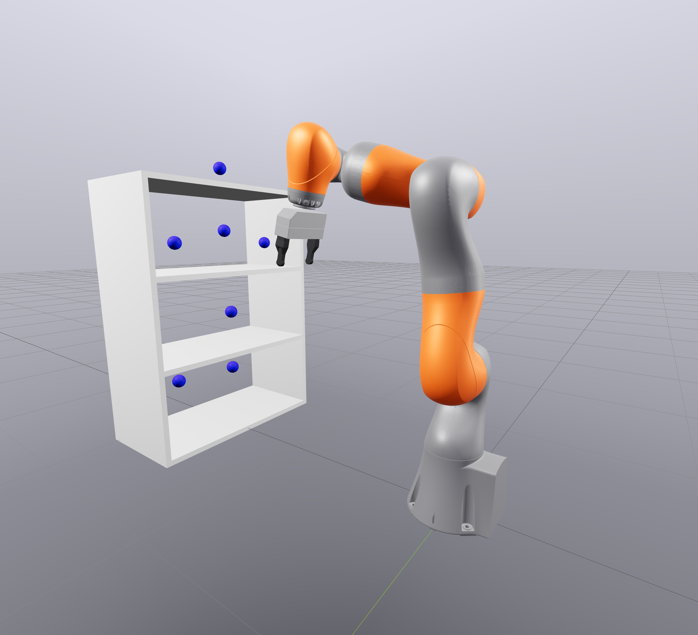
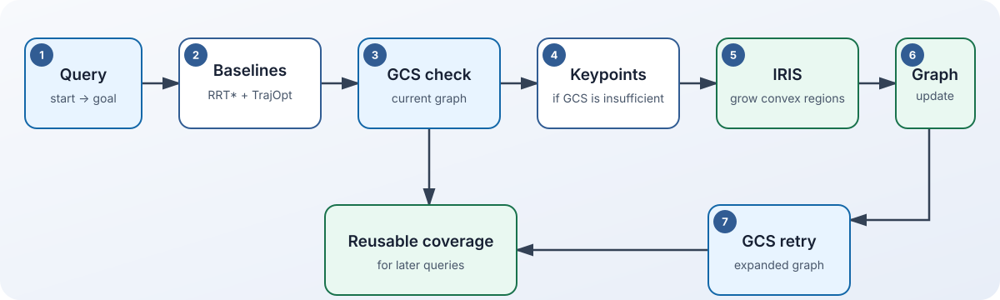
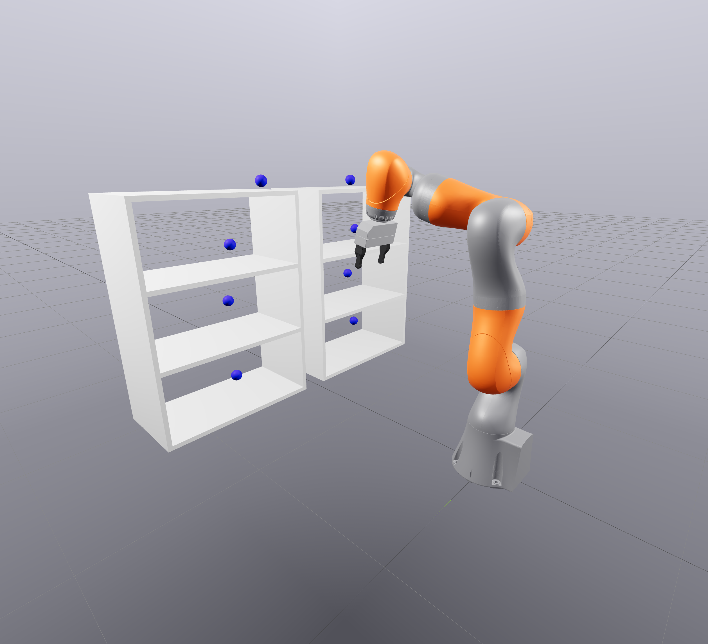
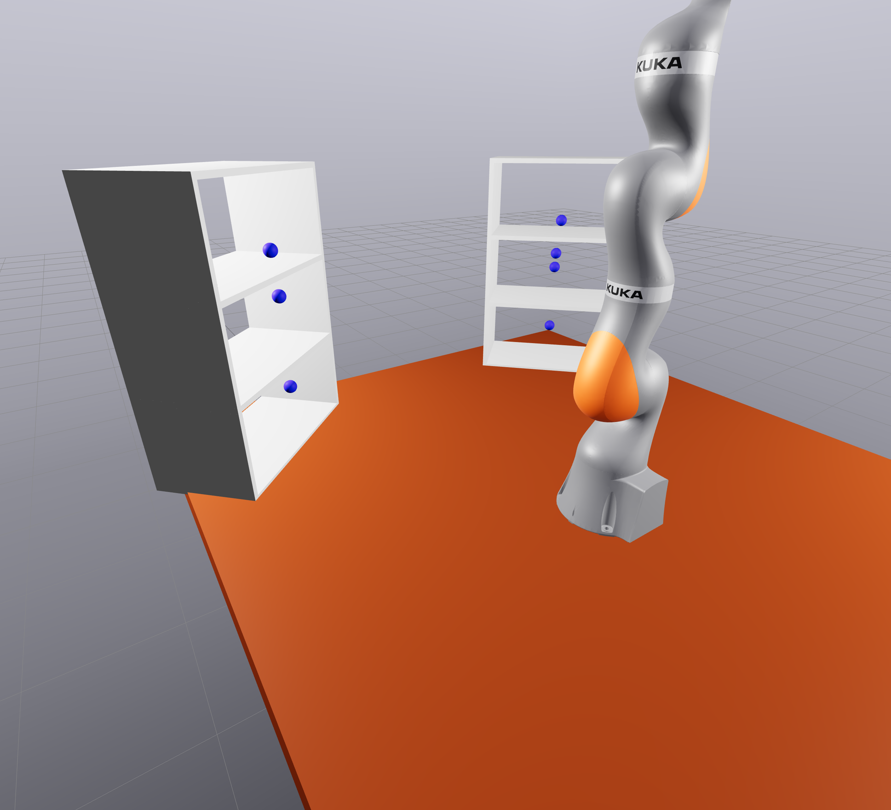

[English](README.md) | [Русский](README.ru.md)

# Online GCS

[](https://www.python.org/)
[](LICENSE)
[](CHANGELOG.md)

Онлайн-планирование движений робота-манипулятора с расширением Graph of Convex
Sets только тогда, когда запросу нужны новые свободные от столкновений области.



## Обзор

Online GCS объединяет Graphs of Convex Sets (GCS) из
[Drake](https://drake.mit.edu/), области IRIS, RRT* и TrajOpt. Стандартный запуск
оценивает RRT* для каждого запроса и TrajOpt, когда этот baseline находит путь, а
затем проверяет текущий граф выпуклых областей. При недостаточном покрытии GCS
алгоритм расширяет граф вокруг полезных точек пути RRT* и повторяет GCS.

Репозиторий содержит устанавливаемый пакет `online-gcs-planner`, команду
`online-gcs`, типизированный публичный Python API, детерминированные примеры, тесты
и согласованную документацию на английском и русском языках.

## Зачем online GCS?

Статическому GCS-планировщику нужно полезное выпуклое покрытие до поступления
запросов. Построение большого покрытия заранее может быть дорогим, а небольшое
покрытие может не соединить новые начало и цель. В проекте исследуется промежуточный
подход: переиспользовать готовые области и расширять граф вдоль успешного пути
семплирующего планировщика только после того, как запрос обнаружил пробел.

Это исследовательское ПО. Репозиторий не заявляет, что онлайн-стратегия превосходит
любой статический или семплирующий планировщик; скрипты и фиксированные seed нужны,
чтобы поведение можно было изучить и воспроизвести.

## Как это работает



Для каждого запроса стандартный запуск сначала выполняет baseline RRT* и, при
наличии пути, baseline TrajOpt для сбора сравнительных метрик. Затем проверяется
текущий граф GCS. Если покрытия или решения GCS недостаточно, fallback-ветка
обновляет двунаправленный путь RRT*, после чего выбранные ключевые точки становятся
seed для новых областей IRIS; области добавляются в граф, а GCS запускается
повторно. Следующие запросы могут использовать расширенное покрытие.

Поэтому время стандартного запуска включает baseline-вычисления RRT* и обычно
TrajOpt, даже если GCS успешно. Выполнение TrajOpt и режим `--opt-only` зависят от
наличия совместимого solver; дополнительное время IRIS появляется только при
расширении покрытия.

## Быстрый старт

Требуется Python 3.12. Выполните из корня репозитория:

```bash
python3.12 -m venv .venv
source .venv/bin/activate
python -m pip install -e .
online-gcs --scene SINGLE_SHELF --iterations 1 --keypoints 2 --prune-interval 0
```

При первом запуске могут загрузиться модели роботов для Drake и `manipulation`.
Дополнительные зависимости для разработки и документации описаны в
[инструкции по установке](docs/ru/installation.md).

## Python API

Тот же детерминированный запуск одного запроса доступен через публичный API:

```python
from online_gcs import OnlineGCS, SceneType

planner = OnlineGCS(
    scene_type=SceneType.SINGLE_SHELF,
    random_seed=42,
    max_iterations=1,
)
summary = planner.run(num_keypoints=2, prune_interval=0)
print(summary["total_queries"])
```

`OnlineGCS`, `OnlineGCSStats`, `GCSPathPlanner`, `RRTStarPlanner`,
`IRISRegionBuilder` и `SceneType` образуют публичный интерфейс версии `0.1.0`.
Подробности приведены в [справочнике API](docs/ru/api.md).

## Демо и сцены

| Одна полка | Две полки | Стол и три полки |
|:--:|:--:|:--:|
|  |  |  |
| `SINGLE_SHELF` | `TWO_SHELVES` | `TABLE_THREE_SHELVES` |

Запустите детерминированные примеры без визуализации и с Meshcat:

```bash
python examples/minimal_online.py
python examples/visualize_single_shelf.py
```

## Воспроизводимость

Примеры задают random seed явно. Сгенерированные области и результаты экспериментов
следует записывать только в игнорируемые каталоги `artifacts/` или `results/`.
Короткий набор проверок:

```bash
python scripts/check_public_tree.py
pytest tests/unit tests/repo
ruff check .
mkdocs build --strict
```

Границы между примерами и исследовательскими экспериментами, а также поддерживаемые
проверки описаны в разделе [«Воспроизводимость»](docs/ru/reproducibility.md).

## Статус и ограничения

Версия `0.1.0` — исследовательский релиз до 1.0; публичные интерфейсы ещё могут
измениться. Построение областей IRIS может быть медленным, особенно в сложных сценах.
При первом запуске Drake/`manipulation` могут загрузить модели. Оптимизация траектории
зависит от наличия совместимого solver в локальной установке Drake. Время работы
также зависит от сцены, seed, платформы и solver.

Поддерживаемая версия для этого релиза — Python 3.12. Перед сообщением о проблеме с
установкой, solver или Meshcat прочитайте раздел
[«Решение проблем»](docs/ru/troubleshooting.md).

## Документация

Полная документация доступна на [английском](docs/en/index.md) и
[русском](docs/ru/index.md) языках. Она описывает установку, идеи алгоритма,
архитектуру, CLI и API, примеры и решение проблем. Переключатель языка доступен на
каждой странице собранного сайта MkDocs.

## Участие в разработке

Мы приветствуем точечные исправления ошибок, тесты, улучшения документации и
планировщиков. Перед pull request прочитайте [CONTRIBUTING.md](CONTRIBUTING.md) и
[Кодекс поведения](CODE_OF_CONDUCT.md). Для воспроизводимых сообщений об ошибках и
предложений используйте шаблоны issue.

## Цитирование

Если программа помогла вашей работе, используйте метаданные из
[CITATION.cff](CITATION.cff). GitHub позволяет экспортировать их в распространённых
библиографических форматах через меню «Cite this repository».

## Лицензия

Проект выпущен под [лицензией MIT](LICENSE). Copyright © 2026 Milana Krivova.
Сторонние зависимости сохраняют собственные лицензии; см.
[THIRD_PARTY_NOTICES.md](THIRD_PARTY_NOTICES.md).
